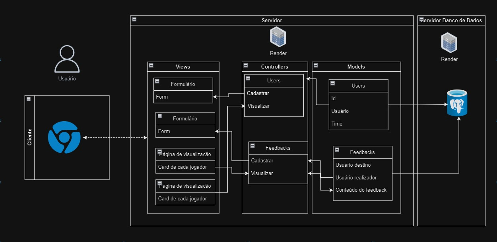

# Exemplo de Design de Arquitetura

Figura X - Matriz de risco

Fonte: Material produzido pelos autores (2024)

Link de download Draw.io: (https://drive.google.com/file/d/1hQliuMZirU0yiKzAr0d_5koE5qVwEQ2K/view?usp=sharing) 

# Template Readme para Arquitetura MVC em Markdown
- Nome do Projeto: WebSite 
- Descrição: É um site de suporte para o jogo cesim
- Arquitetura: MVC (Model-View-Controller)
- Ferramenta de Diagramação: draw io

### Modelos (Models):
- Os modelos são basicamente aquilo que será armazenado e no nosso site de conteúdo sendo basicamente o perfil de cada usuário e suas infromações. Além de armazenar os feedbacks de cada usuário tendo como função armazenar quem fez o feedback a para quem vai ser enviado, também armazenando o conteúdo de cada feedback

### Controladores (Controllers):

- Os controladores do site, na parte de usuário é basicamente o controle de cadastrar novos usários e ter a função de mostrar perfil de cada usuário. É basicamente como vai acontecer nos feedbacks, terá os mesmos controles de cadastrar que vai ser feito a partir de um formulário no site, e um lugar de visualizar o resultado de cada feddback feito pelos outros usuários, o conteúdo vai ser conseguido no models de usuários como mostrado no MVC.

### Views (Views):
- Tem os formulários para conseguir as informações e as páginas de visualização do conteúdo conseguido 
### Infraestrutura:

- Descreva os componentes de infraestrutura do seu projeto, como bancos de dados, APIs externas e outras dependências.
- Explique como a infraestrutura se integra à arquitetura MVC.
-Não consigo fazer isso com meu conhecimento atual infelizmente, não sei exatamente o que uma API faz e como ela influencia no fluxo de informações  

### Justifique as escolhas feitas e como elas impactam o projeto.
#### Implicações da Arquitetura:
Descreva as implicações da arquitetura em termos de escalabilidade, manutenção, testabilidade e outros aspectos importantes.

### Recursos Adicionais:
- Documentação do Sails.js: https://github.com/balderdashy/sails
- Tutorial do draw.io: https://m.youtube.com/watch?v=w3zm-wbmlpc
- Exemplos de diagramas MVC: https://www.lucidchart.com/pages/templates